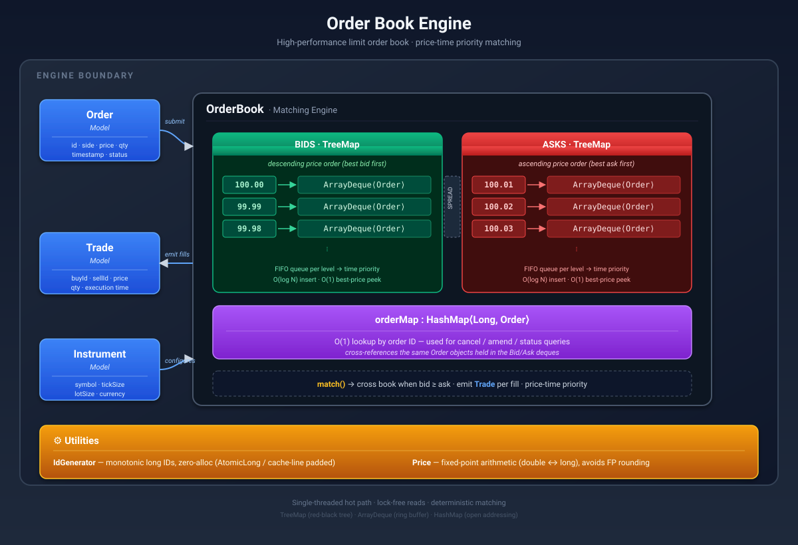
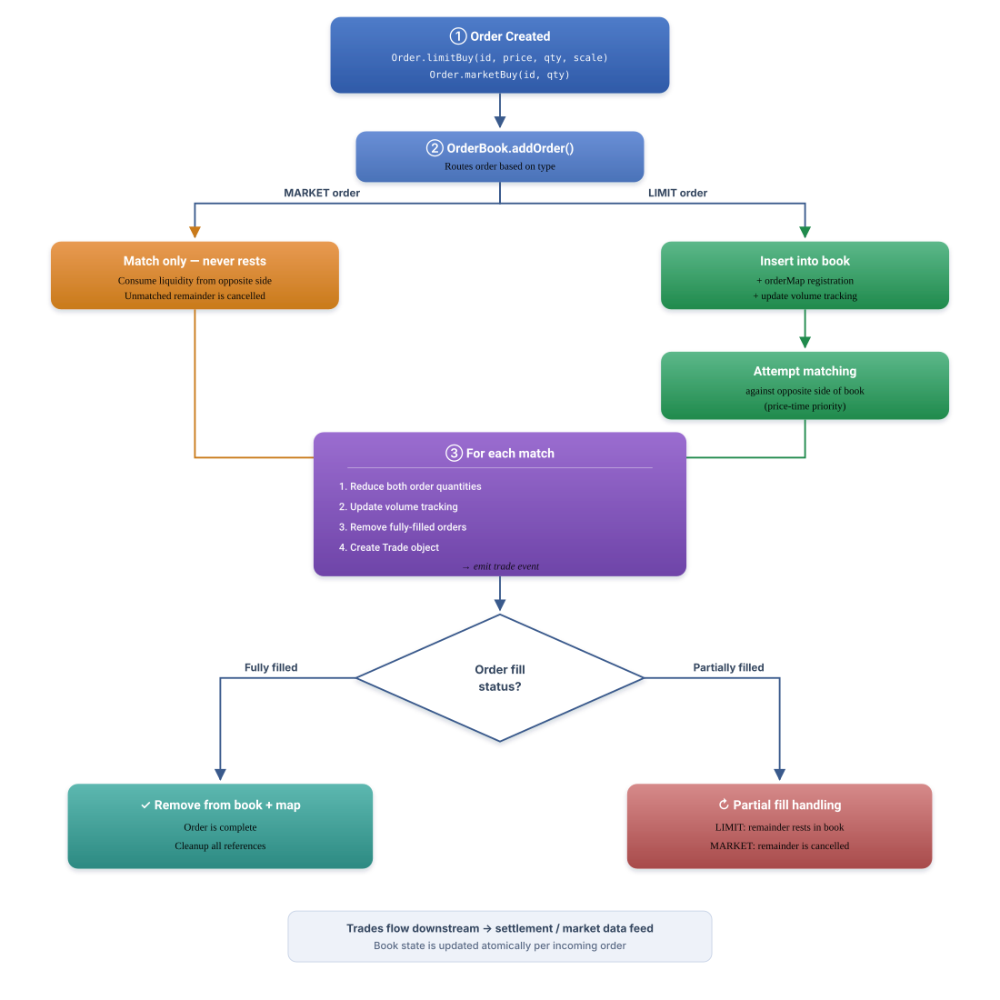
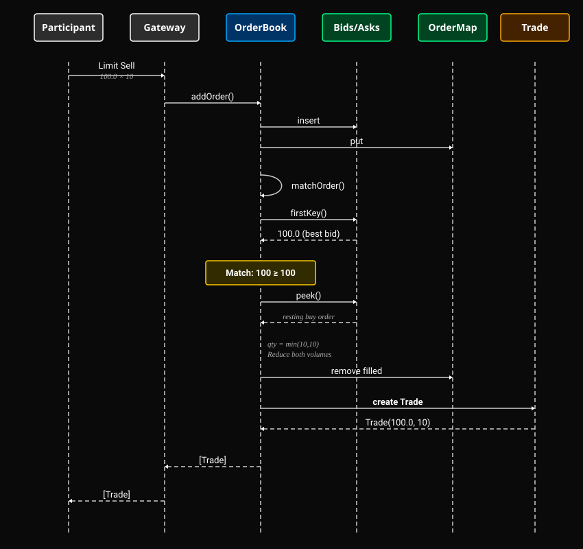
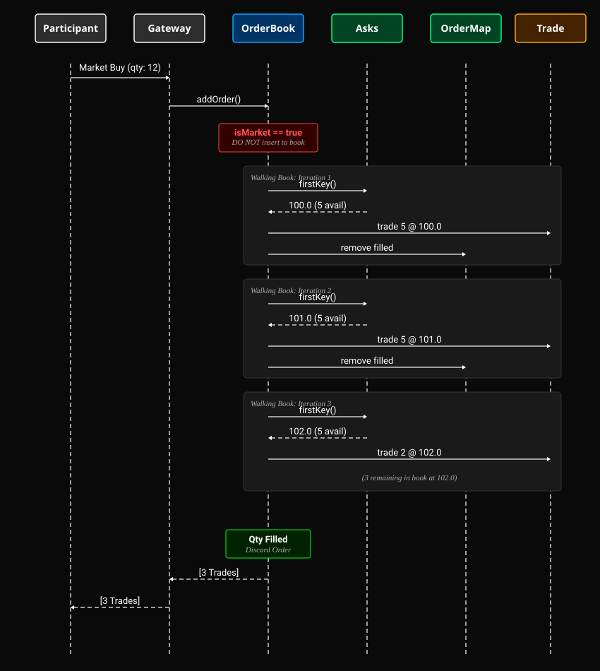

# Order Book Engine

A high-performance order book matching engine built in Java 21,
designed with TDD methodology and optimised for low-latency execution.

Currently Covering LIMIT ORDERS and MARKET ORDERS.

## Table of Contents

- [Architecture Overview](#architecture-overview)
- [Features](#features)
- [Order Lifecycle](#order-lifecycle)
- [Matching Engine Sequence Diagram](#matching-engine-sequence-diagram)
- [Performance](#performance)
- [Optimisation Journey](#optimisation-journey)
- [Project Structure](#project-structure)
- [Running Execution](#running-execution)


# Architecture Overview



# Features
## Order Types

```aiignore
Type	Has Price	Rests in Book	    Behaviour
LIMIT	  ✅	         ✅	            Matches at limit price or better, rests remainder
MARKET	  ❌	         ❌	            Matches any available price, cancels remainder
```

## Order Operations

```aiignore
Operation	 Description	                            Time Complexity
Add	         Insert order, attempt matching	            O(log P + M)
Cancel	     Remove resting order from book       	    O(log P)
Modify	     Cancel + re-add (loses time priority)	    O(log P + M)
```
P = number of price levels, M = number of matches

## Matching Rules

- Price-Time Priority: best price first, then earliest order at same price
- Limit Orders: bid price ≥ ask price triggers match
- Market Orders: match against any resting price, sweep through levels
- Partial Fills: supported — remainder stays (limit) or cancels (market)

## Book Queries

```aiignore
Query	             Description	                      Complexity
Best Bid/Ask	     Top of book	                        O(1)*
Spread	             Best ask − best bid	                O(1)*
Depth	             Number of price levels per side	    O(1)
Volume at Price	     Sum of quantities at a price level	    O(K)
Total Volume	     Aggregate across all levels	        O(1)
Trade Count	         Total trades executed	                O(1)
```
O(1) amortised — TreeMap.firstKey() is O(log P) worst case

# Order Lifecycle



# Matching Engine Sequence Diagram

## Limit Order -- Full Match

# Market Order -- Multi-Level Sweep




# Performance

## Environment
- JDK: OpenJDK 21.0.4 (Temurin)
- JMH: 1.37
- Hardware: Apple Silicon M3 PRO (single-threaded)
- Methodology: 5 warmup iterations, 10 measurement iterations, 2 forks

```aiignore
Benchmark	                        Latency (ns/op)	    Alloc (B/op)	Description
Limit orders (mixed, with match)	113.5 ± 1.4	        469.5	        100K orders, ~50% match rate
Limit orders (insertion only)	    27.7 ± 0.4	        259.9	        100K orders, zero matches
Market orders (always match)	    28.2 ± 0.4	        368.6	        10K orders vs deep book
```
# Optimisation Journey

## Latency & Memory Optimizations Dashboard

```aiignore
                            (Baseline)
Benchmark                │ UUID+LinkedList │ Long+ArrayDeque │ +LazyTradeList  │ +MarketOrders   │ vs Baseline
─────────────────────────┼─────────────────┼─────────────────┼─────────────────┼─────────────────┼──────────────────
ingest100KOrders (ns/op) │ 233.8 ± 6.2     │ 113.3 ± 0.7     │ 115.6 ± 0.7     │ 113.5 ± 1.4     │ 51.4% faster
ingest100KOrders (B/op)  │ 716.0           │ 477.2           │ 453.5           │ 469.5           │ -246.5 (34.4%)
ingest100KNoMatch (ns/op)│ 71.1 ± 3.1      │ 31.9 ± 0.1      │ 28.2 ± 1.0      │ 27.7 ± 0.4      │ 61.0% faster
ingest100KNoMatch (B/op) │ 485.1           │ 267.9           │ 243.9           │ 259.9           │ -225.2 (46.4%)
ingest10KMarket (ns/op)  │      —          │      —          │      —          │ 28.2 ± 0.4      │ new metric
ingest10KMarket (B/op)   │      —          │      —          │      —          │ 368.6           │ new metric
```

## 1. UUID --> Monotonic Long IDs

https://github.com/alvintho/hft-low-latency-order-book/pull/18

Problem: UUIDBenchmark operation is a significant portion of the ingest orders benchmark. UUID.randomUUID() calls SecureRandom, which is cryptographically
secure but involves kernel entropy and internal synchronisation. Each call
allocates a 128-bit object (~128 B including internal byte[16]).

Solution: Monotonic long counter via IdGenerator. Zero allocation,
zero contention, zero syscall. In production exchanges, order IDs are always
sequencer-assigned longs — never random UUIDs.

Design decision: IDs are caller-provided, not self-generated. The Order
object doesn't own its identity — the gateway/sequencer does.

## 2. LinkedList → ArrayDeque

Problem: LinkedList allocates a Node object (24 bytes) per insertion.
Nodes are scattered in heap memory, causing cache misses during traversal.

Solution: ArrayDeque uses a contiguous backing array. No per-element
allocation. Cache-friendly sequential access. Same O(1) peek()/poll()
contract.

Key insight: The timing improvement was marginal, but variance dropped
dramatically. Assumption: predictable latency matters more than average latency due to production stability.
A system with 100ns ± 0.1ns is preferable to 95ns ± 50ns.


## 3. Lazy Trade List Allocation

https://github.com/alvintho/java-order-book-low-latency/pull/19

Problem: Every addOrder() call created new ArrayList<>() for the
return value, even when no trades occurred (~70% of orders in a typical book).
Empty ArrayList allocates ~64 bytes (header + backing Object[10]).

Solution: Return Collections.emptyList() singleton on the no-match
fast path. Lazy-initialise ArrayList(4) only when first match occurs.
Pre-sized to 4 because most orders match 1-3 resting orders.

Design insight: The initial implementation with an early-exit price check
regressed the matching path by 19ns due to redundant TreeMap.firstKey()
calls. Removed it — the while loop already handles the check. Lesson:
measure every change; intuition about performance is unreliable.


# Project Structure

```aiignore
src/main/java/org/example/
├── model/
│   ├── Instrument.java
│   ├── Order.java
│   ├── OrderType.java
│   ├── Side.java
│   └── Trade.java
├── engine/
│   └── OrderBook.java
├── util/
│   ├── IdGenerator.java
│   └── Price.java
├── benchmark/
│   ├── LimitOrderBenchmark.java
│   ├── MarketOrderBenchmark.java
│   └── UUIDBenchmark.java
└── Main.java

src/test/java/org/example/
├── model/
│   ├── InstrumentTest.java
│   ├── OrderTest.java
│   ├── OrderTypeTest.java
│   └── TradeTest.java
├── engine/
│   ├── OrderBookTest.java
│   └── OrderMatchingTest.java
└── util/
    ├── IdGeneratorTest.java
    └── PriceTest.java
```


# Running Execution

## Tests
```aiignore
mvn test
```

## Benchmarks

```aiignore
mvn clean package
java -jar target/limit_order_book_engine-1.0-SNAPSHOT.jar -prof gc
```

## Single Benchmark Class

```aiignore
java -jar target/limit_order_book_engine-1.0-SNAPSHOT.jar LimitOrderBenchmark -prof gc
java -jar target/limit_order_book_engine-1.0-SNAPSHOT.jar MarketOrderBenchmark -prof gc
```