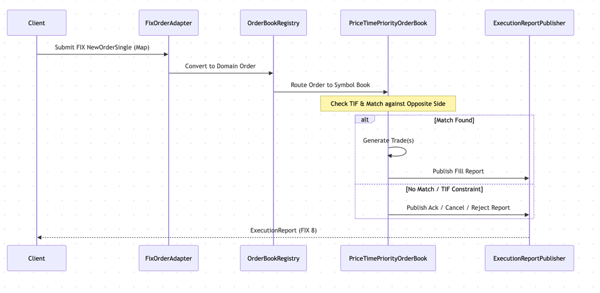

# Order Book Engine
**A FIX 4.4 Aligned Order Book Implementation**

This document serves as the technical summary and presentation guide for the Matching Engine. It describes the architecture, business logic, and design decisions used to build a low-latency, deterministic trading system.

---

## 1. Project Scope
The goal of this system is to provide a robust, in-memory matching engine that handles the lifecycle of tradeable instruments and orders with high precision.

*   **Standardization:** Fully aligned with **FIX 4.4 Protocol** specifications for `NewOrderSingle` and `ExecutionReport`.
*   **Multi-Symbol Support:** Independent order books managed via a centralized `OrderBookRegistry`.
*   **Order Capabilities:**
    *   **Order Types:** Market and Limit orders.
    *   **Time-In-Force (TIF):** GTC (Good 'Til Canceled), IOC (Immediate or Cancel), and FOK (Fill or Kill).
*   **Precision:** Eliminates floating-point rounding errors by utilizing **scaled-integer pricing** (converting doubles to longs).

---

## 2. Core Business Logic
The engine implements a strict **Price-Time Priority (FIFO)** matching algorithm.

### Matching Rules
1.  **Bids (Buy Side):** Highest price takes priority. For identical prices, the order that arrived first is executed first.
2.  **Asks (Sell Side):** Lowest price takes priority. For identical prices, the order that arrived first is executed first.
3.  **Execution:** When an incoming order's price overlaps with the opposite side (Buy $\ge$ Ask or Sell $\le$ Bid), a `Trade` is generated and the quantity is deducted from both parties.

### Time-In-Force (TIF) Handling
| TIF | Behavior |
| :--- | :--- |
| **GTC** | Rests in the book until fully filled or manually canceled. |
| **IOC** | Matches immediately against available liquidity; any remaining quantity is canceled. |
| **FOK** | "All or nothing." If the full quantity cannot be filled immediately, the order is rejected. |

---

## 3. Design Patterns & Justification
To ensure maintainability and scalability, several industry-standard design patterns were employed:

| Pattern | Component | Justification |
| :--- | :--- | :--- |
| **Adapter** | `FixOrderAdapter` | Decouples raw FIX wire formats from the Domain Model, allowing the engine to remain transport-agnostic. |
| **Observer** | `ExecutionReportPublisher` | Decouples the engine from downstream systems (Risk, OMS, UI). The engine emits events without knowing the consumers. |
| **Builder** | `Order.Builder` | Ensures complex order objects are constructed in a valid state and supports immutable snapshotting for reports. |
| **Registry** | `OrderBookRegistry` | Routes orders to the correct symbol-specific book and manages the lifecycle of multiple instruments. |
| **Value Object** | `Trade`, `Instrument` | Uses immutability to ensure thread-safety and data integrity across the system. |

---

## 4. Order Flow (Sequence)
Below is the logical flow from the moment a client submits a request to the final execution report.

---

## 5. Technical Architecture
The system is structured to separate concerns between the "Wire" (FIX), the "Routing" (Registry), and the "Execution" (Order Book).

### Class Relationships
*   **`OrderBookRegistry`** $\rightarrow$ Manages a Map of `BaseOrderBook` implementations.
*   **`BaseOrderBook`** $\rightarrow$ Interface defining the matching API.
*   **`PriceTimePriorityOrderBook`** $\rightarrow$ Concrete implementation using `TreeMap` (for price levels) and `ArrayDeque` (for time priority).
*   **`Order`** $\rightarrow$ The central domain entity tracking `leavesQty`, `cumQty`, and `avgPx`.
*   **`Price` Utility** $\rightarrow$ Handles the conversion between `double` (UI) and `long` (Engine).

---

## 6. Technical Highlights
*   **Deterministic Execution:** The combination of `TreeMap` and `ArrayDeque` ensures $O(\log N)$ price discovery and $O(1)$ time-priority access.
*   **Zero Precision Loss:** By scaling prices to integers, the system avoids the common `0.1 + 0.2 = 0.30000000000000004` error found in financial software.
*   **Extensibility:** Because the engine depends on the `BaseOrderBook` interface, the matching algorithm (e.g., moving from FIFO to Pro-Rata) can be swapped without modifying the rest of the system.
